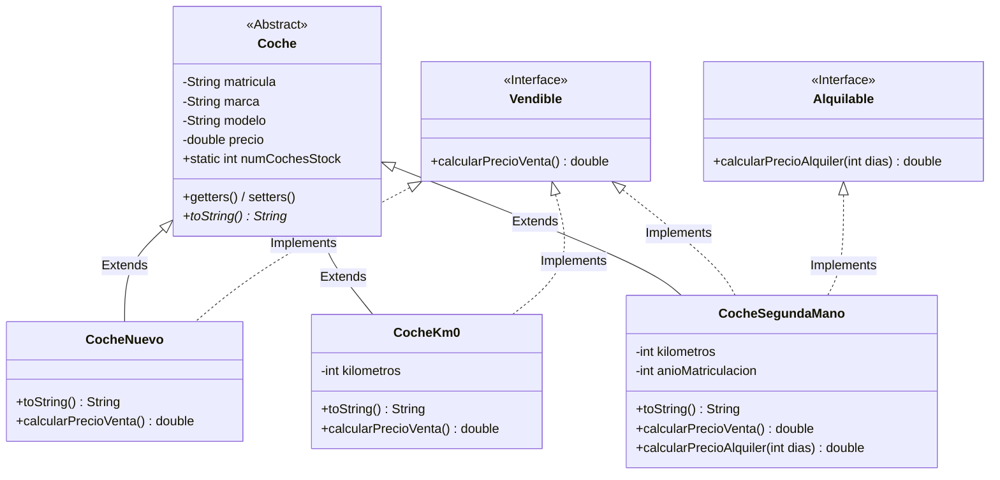

# 🚗 Dealership Vehicle Management System

> Console-based automotive dealership inventory application built with core Java, implementing Object-Oriented Design (OOD) patterns, polymorphism, and modular domain architecture.

[](https://www.oracle.com/java/)
[](https://en.wikipedia.org/wiki/Object-oriented_programming)
[](https://www.jetbrains.com/idea/)

---

## 📌 Project Overview

**Dealership Vehicle Management System** is a robust console application engineered to demonstrate pure Object-Oriented Programming (OOP) fundamentals and clean code principles in Java without framework abstractions.

The system manages multi-type vehicle inventory through an interactive CLI, enforcing strict domain validation, type categorization, and contracts for sales and rentals.

---

## 🧠 Key OOP Concepts & Architectural Patterns

- **Abstraction & Base Template:** Abstract base class (`Coche`) defining the shared template for vehicle identity, attributes, state validation, and formatting contracts.
- **Inheritance & Domain Specialization:** Concrete extensions (`CocheNuevo`, `CocheKm0`, `CocheSegundaMano`) adapting specific behaviors, registration rules, and pricing dynamics.
- **Interface Segregation (ISP):** Decoupled business capabilities through contracts (`Vendible` and `Alquilable`), allowing flexible behavior attribution across different inventory types.
- **Runtime Polymorphism:** Unified collection handling (`ArrayList<Coche>`) processing distinct subclass behaviors dynamically via dynamic method dispatch.
- **Global Inventory Tracking:** Encapsulated class-level static state (`numCochesStock`) guaranteeing thread-safe and real-time inventory counter consistency.
- **Defensive CLI Input Handling:** Safe parsing and validation loops using `java.util.Scanner` to isolate user input from domain state integrity.

---

## 🏛️ Class Hierarchy & Domain Model



---

## 🛠️ Project Structure

```text
src/
└── com/concesionario/
    ├── model/
    │   ├── Coche.java                  # Abstract base entity
    │   ├── CocheNuevo.java             # Factory-new vehicle variant
    │   ├── CocheKm0.java               # Demo / pre-registered variant
    │   └── CocheSegundaMano.java       # Pre-owned / rental vehicle variant
    ├── interfaces/
    │   ├── Vendible.java               # Sales business contract
    │   └── Alquilable.java             # Rental business contract
    └── main/
        └── Concesionario.java          # CLI controller, router, and inventory runner
```

---

## 🚀 Execution & Local Setup

### Prerequisites
* **Java Development Kit (JDK):** Version 17 or 21 LTS installed.
* **IDE:** IntelliJ IDEA, Eclipse, or VS Code (with Java Extension Pack).

### Steps
1. Clone the repository:
   ```bash
   git clone [https://github.com/Rubenzt8/Concesionario-coches.git](https://github.com/Rubenzt8/Concesionario-coches.git)
   cd Concesionario-coches
   ```
2. Open the project in **IntelliJ IDEA**.
3. Locate `Concesionario.java` in `src/`.
4. Run the `main` method and follow the interactive console prompt.

---

## 👨‍💻 Author

**Rubén Flores Calderón**  
Backend-focused Software Developer  
* LinkedIn: [ruben-flores-calderon](https://www.linkedin.com/in/ruben-flores-calderon)  
* Email: [Rubenzt88@gmail.com](mailto:Rubenzt88@gmail.com)
